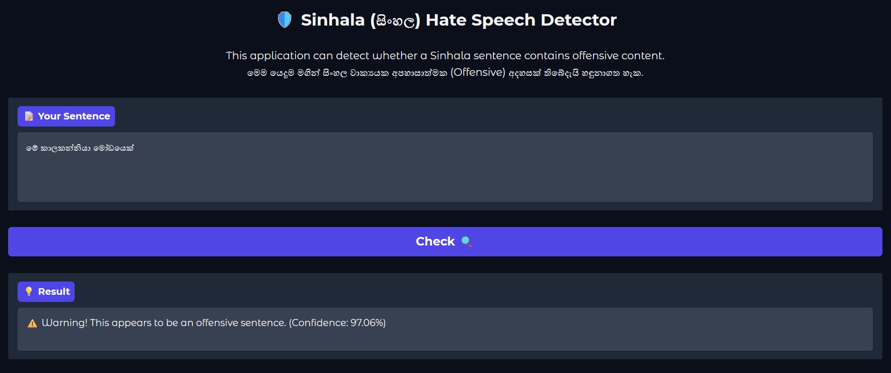
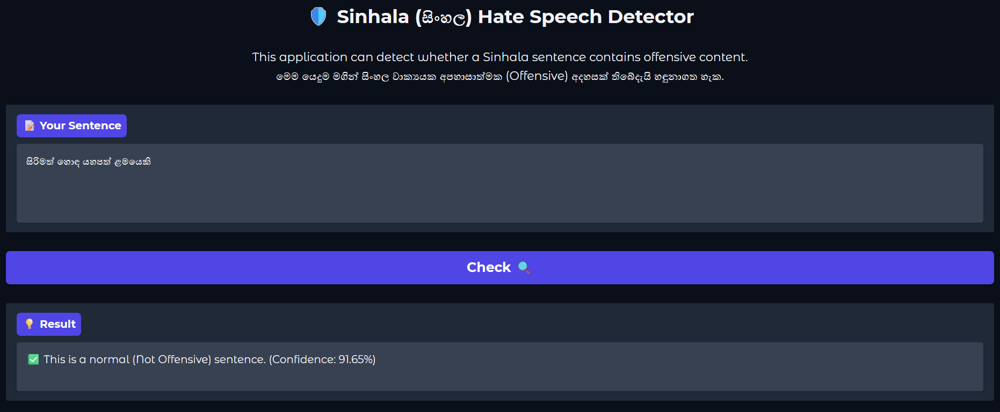

# 🛡️ Sinhala Hate Speech Detector

This is a deep learning-based text classification application built to detect offensive and hate speech in the Sinhala language. The model is fine-tuned on the `sinhala-nlp/SOLD` dataset using the **XLM-RoBERTa** architecture.

## 🚀 Live Demo (Local Installation)

Follow these steps to run the Web App on your local machine.




### 1. Clone the Repository

```bash
git clone [https://github.com/dimuthulk/Sinhala-Hate-Speech-Detector.git](https://github.com/dimuthulk/Sinhala-Hate-Speech-Detector.git)
cd Sinhala-Hate-Speech-Detector
```

### 2. Create a Virtual Environment (Recommended)

```bash
python -m venv env
# On Windows:
env\Scripts\activate
# On Mac/Linux:
source env/bin/activate
```

### 3. Install Dependencies

```bash
pip install -r requirements.txt
```

### 4. Run the Application

```bash
python app.py
```

Open your web browser and go to the provided local URL (usually http://127.0.0.1:7860).

## 🧠 Model Information

The core AI model is hosted on Hugging Face. The application automatically downloads and caches the model upon the first run.

- Model URL: [dimuthulk/sinhala-hate-speech-detector](https://huggingface.co/dimuthulk/sinhala-hate-speech-detector)
- Architecture: XLM-RoBERTa (Base)
- Classes:
  - NOT (Not Offensive)
  - OFF (Offensive)

## 🛠️ Built With

- [Transformers (Hugging Face)](https://huggingface.co/)
- [PyTorch](https://pytorch.org/)
- [Gradio](https://gradio.app/) (For the User Interface)
